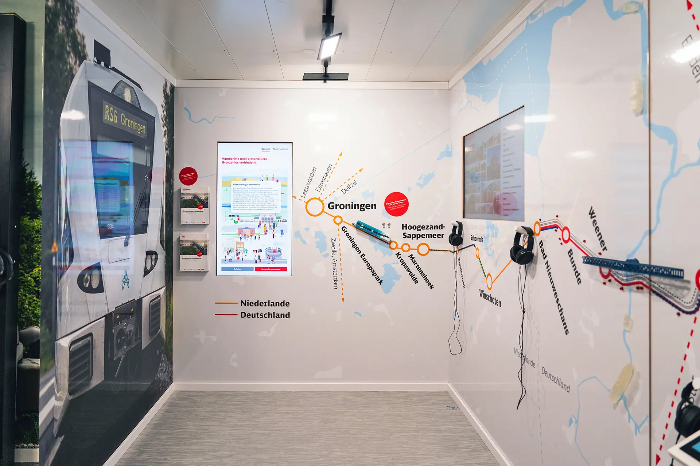

For this commission, I designed and implemented the technical infrastructure for an information center housed in a shipping container on a construction site. The center showcases the Wunderline project—a cross-border rail modernization initiative between Germany and the Netherlands.

<iframe frameborder="0" allowfullscreen="" allow="accelerometer; autoplay; clipboard-write; encrypted-media; gyroscope; picture-in-picture; web-share" referrerpolicy="strict-origin-when-cross-origin" title="Wunderline und Friesenbrücke – Vorstellung der Infobox" class="w-full aspect-video my-10" src="https://www.youtube.com/embed/OUATsTXVrs8?autoplay=0&amp;mute=0&amp;controls=0&amp;origin=https%3A%2F%2Fwww.institut4000.io&amp;playsinline=1&amp;showinfo=0&amp;rel=0&amp;iv_load_policy=3&amp;modestbranding=1&amp;cc_load_policy=1&amp;cc_lang_pref=en&amp;enablejsapi=1&amp;widgetid=1&amp;forigin=https%3A%2F%2Fwww.institut4000.io%2Fcase-studies%2Fdeutsche-bahn&amp;aoriginsup=1&amp;gporigin=https%3A%2F%2Fwww.institut4000.io%2F&amp;vf=2" id="widget2"></iframe>

---

## The Challenge

The project required creating an engaging environment where visitors could learn about the rail modernization through interactive elements. The space needed multiple forms of interaction, including digital and physical components, all working together cohesively. The technical aspects had to be robust enough for daily public use while being visually integrated with the exhibition design.

---

## Solution

I designed and built all technical elements in the information center:

- Interactive touchscreen interfaces with custom software
- A train simulator with physical controls
- Interactive wall map with various tactile and electronic elements
- Custom-designed audio stations and information points
- Integrated media playback systems
- Custom circuit design and programming for all interactive elements

The development process involved learning to design electronic circuits, a field relatively new to me at the time, while ensuring all components would work reliably in a public setting.

---

---

## Result

The completed information center successfully bridges digital and physical interaction, creating an engaging space that helps visitors understand the significance of the rail modernization project. The various interactive elements provide intuitive ways to explore complex infrastructure information. The technical components work seamlessly together, transforming what could have been static information into an interactive experience.

This project demonstrates how digital interfaces can extend beyond conventional applications into physical space, creating more meaningful engagement with information that might otherwise remain abstract to the public.
