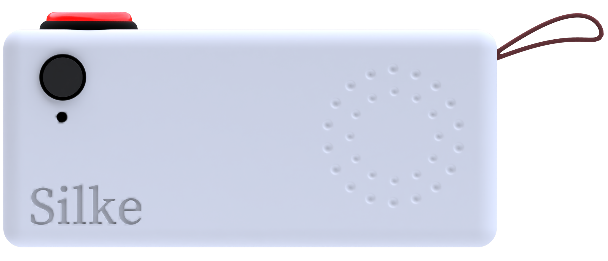
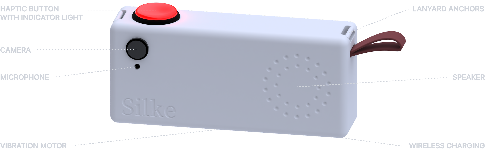
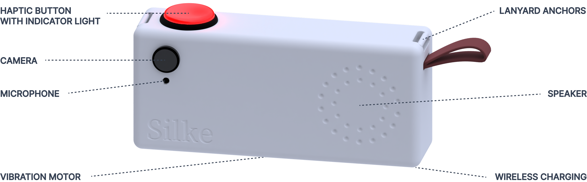

---

## Problem

My grandmother lost vision in one eye years ago, and now only retains 10% vision in the other – enough to perceive colours and vague shapes, but little more. Even basic tasks like reading have become a significant challenge for her, requiring both a magnifying glass and a flashlight.

Finding these essential tools, which often end up scattered throughout her apartment, only compounds her daily struggles.

---

## Solution

Living in Berlin, while my grandma lives in southern Germany, means I can't always be there when she needs an extra pair of eyes. But this challenge inspired a solution: bringing recent AI advancements to her in an accessible, intuitive way.

The technology exists – it just needs to be packaged in a form that actually works for people like my grandma.

---

## Meet Silke

Silke creates independence for people with visual impairments by transforming what it sees into clear audio descriptions. The device recognizes objects, reads text aloud, identifies colors, and describes surroundings—all through natural conversation rather than complex commands or screens.

Every aspect of Silke addresses specific challenges faced by elderly people with limited vision. The single prominent button can be located by touch alone. The lanyard ensures the device is always within reach, not lost in a drawer or between couch cushions. Wireless charging eliminates the frustration of aligning tiny connectors. Vibration patterns provide confirmation without requiring sight.

### How To Use

1. Hold Silke like a camera, pointing at what interests you
2. Press and hold the red button (you'll see it glow)
3. Ask your question naturally while holding
4. Let go of the button (a gentle flash and vibrations show Silke is thinking)
5. Listen as Silke describes what it sees
